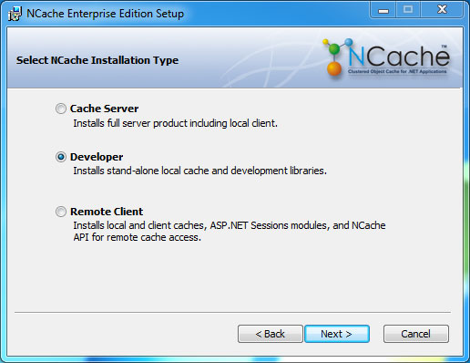
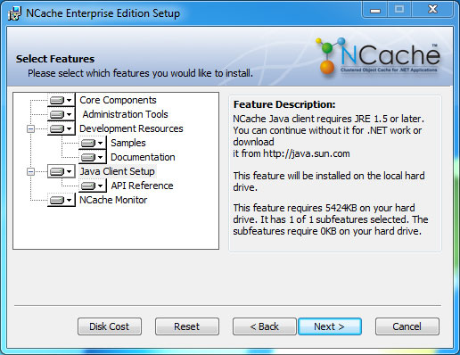
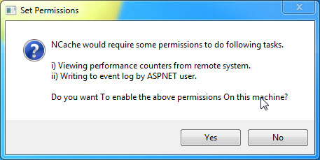
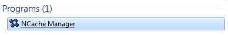
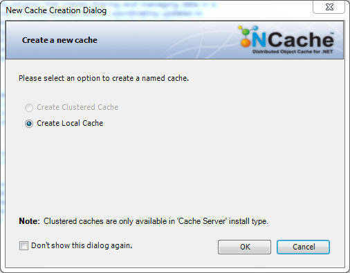
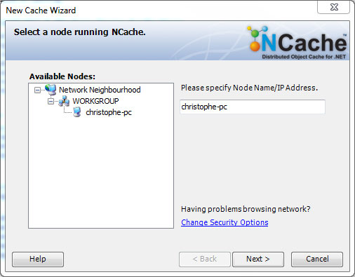
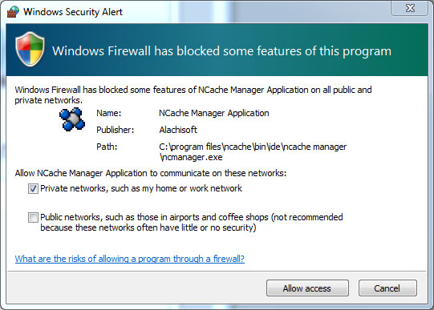
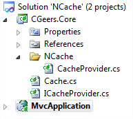
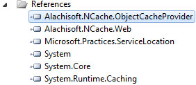

# NCache Distributed In-memory Object Cache

## Introduction

In my last post I discussed how you can setup [Windows AppFabric Caching](https://github.com/geersch/AppFabric) and use it from ASP.NET MVC.

AppFabric isn't the only tool out there that provides you with a distributed in-memory object cache. NCache from [Alachisoft](http://www.alachisoft.com/) is another excellent product which can solve your caching issues.

Let's see it in action...

## Installation

Lets first install NCache. At the time of writing, version 3.8 had just been launched. You can download the professional or enterprise edition on the following page:

[http://www.alachisoft.com/download.html](http://www.alachisoft.com/download.html)

You can choose either the 32-bit or the 64-bit edition.

Start and follow the wizard. We'll be using NCache for object caching and since we are developers we need to install the NCache Developer Edition.

**Figure 1** - Installation Type



**Remark**: Before you can download NCache you need to register yourself on the site. Afterwards you'll receive an installation key via e-mail. You'll need this key in order to complete the installation.

By default all the features will be installed. You can certainly opt to unselect certain components, but I recommend that you install them all.

**Figure 2** - Feature Selection



During the installation, the setup wizard will ask you whether or not you want to automatically set some permissions for NCache.

**Figure 3** - Set Permissions



It needs permission for NCache counters to be viewed in [PerfMon](<http://msdn.microsoft.com/en-us/library/aa645516(VS.71).aspx>) and the ASPNET user needs access to the event log. Allow this unless you have a very good reason not to do so.

Voila, that is all that is required to complete the installation. Just keep clicking next until the installation completes.

**Remark**: You can find a more [comprehensive installation guide for NCache](http://www.alachisoft.com/downloads/NCacheInstallationGuide.pdf) on the site of Alachisoft.

## Administration

After you've installed NCache you need to start the NCache Manager. Just click Start and type in "NCache Manager".

**Figure 4** - NCache Manager



The first time you start the NCache Manager it will automatically ask you which cache type you want to create. We can setup a clustered cache (multiple servers) or a local cache. Since we installed the developer edition we are limited to a local cache. You need to install a Cache Server (see Figure 1) if you want to create a clustered cache.

So go ahead and create a local cache.

**Figure 5** - Cache Creation



Select a node running NCache. This should be your development computer.

**Figure 6** - NCache Node



Be sure to include the Windows firewall exceptions when asked to.

**Figure 7** - Windows Firewall



Specify a name for the cache. I called mine "default". For a local cache the name has to be unique for the node where the cache is created.

**Figure 8** - Cache Name


Keep the default maximum size of 250 megabytes for the cache.

**Figure 9** - Cache Size


Set the eviction strategy for cached objects to "least recently used" (LRU), leave the other settings at their default values, check "Start this cache on Finish" and click Finish to complete the creation of your local cache.

**Figure 10** - Eviction Strategy

]

Your local cache is now up and running.

## Using The Cache in ASP.NET MVC

Let's see if we can use NCache as easily as [AppFabric from within an ASP.NET MVC application](https://github.com/geersch/AppFabric). Start Visual 2010 and create a new blank solution called NCache. The solution contains two projects, a class library (CGeers.Core) and a MVC 2 Web application (MvcApplication).

**Figure 11** - Solution Explorer



The CGeers.Core class library contains references to the following assemblies from NCache.

**Figure 12** - NCache Assembly References



You can find these assemblies in the "bin\\assembly" and "integration\\DotNet4.0 Cache Provider" directories, which are located in the installation directory of NCache (default: C:\\Program Files\\NCache).

**Remark**: Also include a reference to the [System.Runtime.Caching](http://msdn.microsoft.com/en-us/library/system.runtime.caching.aspx) assembly which contains types new to the .NET Framework as of version 4.0. The types found in the Alachisoft.NCache.ObjectCacheProvider assembly require types from this assembly.

I don’t want to use the NCache types directly in my MVC application so I added the following interface to the CGeers.Core library.

**Listing 1** - ICacheProvider Interface

```csharp
public interface ICacheProvider
{
    void Add(string key, object value);
    void Add(string key, object value, TimeSpan timeout);
    object Get(string key);
    object this[string key] { get; set; }
    bool Remove(string key);
}
```

Then I added a static class which acts as a [façade](http://www.dofactory.com/Patterns/PatternFacade.aspx#_self1) and allows me to interact with a cache provider. Internally this static class uses an instance of an ICacheProvider implementation. This dependency injection is resolved using the ServiceLocator type provided by [Unity 2.0](http://unity.codeplex.com/).

**Listing 2** - Cache Façade

```csharp
public static class Cache
{
    private static readonly ICacheProvider CacheProvider;

    static Cache()
    {
        CacheProvider =
            (ICacheProvider) ServiceLocator.Current
                                    .GetInstance(typeof (ICacheProvider));
    }

    public static void Add(string key, object value)
    {
        CacheProvider.Add(key, value);
    }

    public static void Add(string key, object value, TimeSpan timeout)
    {
        CacheProvider.Add(key, value, timeout);
    }

    public static object Get(string key)
    {
        return CacheProvider[key];
    }

    public static bool Remove(string key)
    {
        return CacheProvider.Remove(key);
    }
}
```

Now we only need to create an ICacheProvider implementation for NCache. The following listing shows you how to do this.

**Listing 3** - NCache ICacheProvider Implementation

```csharp
public class CacheProvider : ICacheProvider
{
    private static Alachisoft.NCache.ObjectCacheProvider.CacheProvider _cache;

    private static Alachisoft.NCache.ObjectCacheProvider.CacheProvider GetCache()
    {
        if (_cache != null) return _cache;

        _cache = new Alachisoft.NCache.ObjectCacheProvider.CacheProvider("default");

        return _cache;
    }

    public void Add(string key, object value)
    {
        var cache = GetCache();
        var policy = new CacheItemPolicy();
        cache.Add(key, value, policy);
    }

    public void Add(string key, object value, TimeSpan timeout)
    {
        var cache = GetCache();
        cache.Add(key, value, DateTime.Now.Add(timeout));
    }

    public object Get(string key)
    {
        var cache = GetCache();
        return cache.Get(key);
    }

    public object this[string key]
    {
        get
        {
            var cache = GetCache();
            return cache[key];
        }
        set
        {
            var cache = GetCache();
            cache[key] = value;
        }
    }

    public bool Remove(string key)
    {
        var cache = GetCache();
        return cache.Remove(key) != null;
    }
}
```

All of the methods are pretty straightforward. The Add(…), Remove(…)…etc. methods all use the CacheProvider class provided by NCache. The GetCache() method retrieves a reference to your default cache. If you did not name your cache "default" then you need to change the name here.

**Remark**: When adding an item to the cache a [CacheItemPolicy](http://msdn.microsoft.com/en-us/library/system.runtime.caching.cacheitempolicy.aspx) object is created. This type has a property called AbsoluteExpiration. This is the period of time that must pass before a cache entry is evicted. InfiniteAbsoluteExpiration is the default value, meaning that the entry does not expire. (The ICacheProvider interface also provides an Add(...) method which allows you to specify a timeout).

Now you only need to add a reference to the CGeers.Core assembly from the MVC application and you can use the cache as follows:

**Listing 4** - Adding an Object to the Cache

```csharp
var cacheObject = (Guid?) Cache.Get("MyCachedObject");
if (cacheObject == null)
{
    cacheObject = Guid.NewGuid();
    Cache.Add("MyCachedObject", cacheObject, new TimeSpan(0, 0, 30));
}
```

Don’t forget to configure your Unity container so that the ServiceLocator type (see Listing 2) will find the AppFabric implementation of the ICacheProvider interface. You can do this from your Global.asax Application_Start() event handler.

**Listing 5** - UnityContainer

```csharp
protected void Application_Start()
{
    AreaRegistration.RegisterAllAreas();
    RegisterRoutes(RouteTable.Routes);

    var container = new UnityContainer();
    var section = (UnityConfigurationSection) ConfigurationManager.GetSection("unity");
    section.Configure(container, "defaultContainer");

    var serviceLocator = new UnityServiceLocator(container);
    ServiceLocator.SetLocatorProvider(() => serviceLocator);
}
```

**Remark**: The contents of the UnityContainer are configured in the Web.config. Download the source code for this article if you want to check it out. I'll write a post about setting up a Unity 2.0 container soon, so that in the future I can refer to that article.

Voila, caching with NCache is up and running. This product is up to par with AppFabric and even offers a very nice GUI which you can use to administer your cache cluster(s). Check out the complete [feature matrix](http://www.alachisoft.com/ncache/index.html) if you want to know what else it supports.
